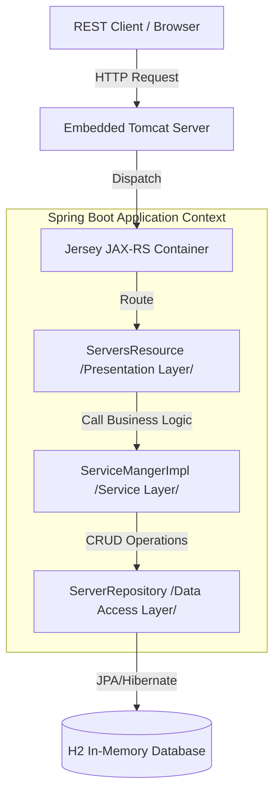
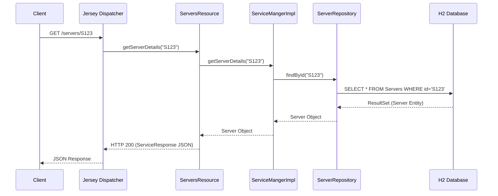
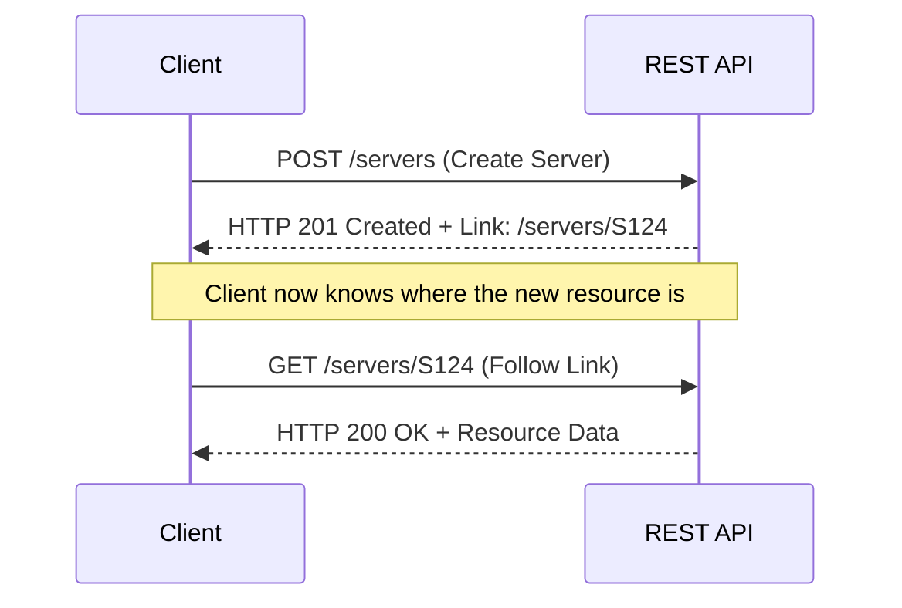

# Architecture & Design Documentation

This document provides a comprehensive overview of the **LetzRestOnJersey** architecture, its underlying design patterns, and an educational guide for building RESTful web services using Spring Boot and Jersey.

---

## 1. Academic Foundation

### What is REST?
**Representational State Transfer (REST)** is an architectural style for providing standards between computer systems on the web, making it easier for systems to communicate with each other. It is built on several key constraints:

1.  **Client-Server:** Decouples the user interface from the data storage, improving portability and scalability.
2.  **Statelessness:** Each request from a client to a server must contain all the information necessary to understand and complete the request. The server does not store any session state.
3.  **Uniform Interface:** Simplifies and decouples the architecture, enabling each part to evolve independently (e.g., using Resources identified by URIs).
4.  **Resource-Based:** Everything is a resource (e.g., a "Server") identified by a URI and manipulated via standard HTTP methods (GET, POST, PUT, DELETE).
5.  **HATEOAS (Hypermedia as the Engine of Application State):** A constraint of REST that distinguishes it from other network application architectures. A client interacts with a network application entirely through hypermedia provided dynamically by the application servers.

### Layered Architecture
This project follows a **Multitier (Layered) Architecture**, which promotes **Separation of Concerns (SoC)**. Each layer has a specific responsibility and only communicates with the layers directly below it.

*   **Presentation Layer (Jersey Resources):** Handles HTTP requests, validates input, and formats responses.
*   **Service Layer (Service Managers):** Encapsulates the core business logic and orchestrates data flow.
*   **Data Access Layer (JPA Repositories):** Manages the persistence and retrieval of data from the database.

---

## 2. Design Patterns (Deep Dive)

The application utilizes several industry-standard design patterns to ensure scalability, maintainability, and loose coupling.

### A. Dependency Injection (Inversion of Control)
*   **Pattern:** Inversion of Control (IoC) via Dependency Injection (DI).
*   **Implementation:** Spring Boot manages the lifecycle of objects (Beans). Instead of classes creating their dependencies (e.g., `new ServiceMangerImpl()`), Spring "injects" them using annotations like `@Autowired`.
*   **Benefit:** Decouples classes from their implementations, making them easier to test and swap.

### B. Repository Pattern
*   **Pattern:** Repository Pattern.
*   **Implementation:** `ServerRepository` extends `JpaRepository`. It provides an abstraction for the data layer, hiding the details of SQL or JPA queries.
*   **Benefit:** Separates the domain logic from the persistence logic.

### C. Singleton Pattern
*   **Pattern:** Singleton Pattern.
*   **Implementation:** By default, all Spring Beans (like `ServiceMangerImpl` and `ServersResource`) are created as singletons. Only one instance of these classes exists within the application context.
*   **Benefit:** Reduces memory overhead and provides a single point of state management for stateless services.

### D. Proxy Pattern
*   **Pattern:** Proxy Pattern.
*   **Implementation:**
    1.  **Spring AOP:** Spring creates dynamic proxies for classes annotated with `@Transactional` (managing database transactions behind the scenes).
    2.  **ProxyHelper:** The `ProxyHelper` class acts as a gateway/proxy for communicating with external APIs, abstracting the complexities of HTTP headers and body mapping.
*   **Benefit:** Adds additional logic (security, logging, transactions) without modifying the core class.

### E. Data Transfer Object (DTO)
*   **Pattern:** DTO / Data Mapper.
*   **Implementation:** `ServiceResponse<T>` is used to wrap all API responses. It provides a consistent structure (payload, error codes, messages) regardless of the underlying data type.
*   **Benefit:** Ensures a stable contract with the API client, shielding them from internal database entity changes.

### F. HATEOAS (Dynamic Linking)
*   **Pattern:** Hypermedia as the Engine of Application State.
*   **Implementation:** 
    1.  **JAX-RS `UriInfo`:** The `ServersResource` uses `@Context UriInfo` to dynamically discover the base URI of the request.
    2.  **Custom Annotations:** The `ResponseLinks` annotation is used to declaratively define which methods should be linked in the response.
    3.  **UriBuilder:** The `hateoasBuilder()` method programmatically constructs links to related resources (e.g., a "self" link after creating a server).
*   **Benefit:** Makes the API self-discoverable; clients don't need to hardcode URLs, as the server provides them in the response.

---

## 3. Visualizing the Flow

### High-Level Architecture
This diagram shows how different components interact across the layers.



### Sequence Diagram: GET /servers/{id}
This diagram illustrates the lifecycle of a single request.



---

## 4. Developer Guide: Building a Service

Follow these steps to develop a new RESTful service in this project:

### Step 1: Define the Domain Model
Create a Java class in `com.smd.model` and annotate it with `@Entity` for JPA persistence.

```java
@Entity
public class User {
    @Id
    private String userId;
    private String name;
    // Getters and Setters
}
```

### Step 2: Create the Repository
Create an interface in `com.smd.repository` extending `JpaRepository`. Spring will automatically generate the implementation.

```java
public interface UserRepository extends JpaRepository<User, String> {
}
```

### Step 3: Implement Business Logic
Add the logic to your Service Manager (e.g., `ServiceMangerImpl`). This is where you calculate, filter, or validate data.

```java
@Service
public class UserService {
    @Autowired
    UserRepository repo;

    public User createUser(User user) {
        return repo.save(user);
    }
}
```

### Step 4: Expose the REST Resource
Create a class in `com.smd.resources` using JAX-RS annotations (`@Path`, `@GET`, `@POST`).

```java
@Component
@Path("/users")
public class UserResource {
    @Autowired
    UserService service;

    @POST
    @Produces("application/json")
    public Response createUser(User user) {
        User saved = service.createUser(user);
        return Response.status(201).entity(saved).build();
    }
}
```

### Step 5: Register the Resource
Add the new resource class to the `JerseyConfig.java` file.

```java
public class JerseyConfig extends ResourceConfig {
    public JerseyConfig() {
        register(ServersResource.class);
        register(UserResource.class); // Register your new resource here
    }
}
```

---

## 5. HATEOAS Implementation Details

In this project, HATEOAS is implemented to allow clients to navigate the API via links.

### How to add a "Self" Link to a Response:
1.  **Inject UriInfo:** Use the `@Context` annotation in your Resource class.
2.  **Use UriBuilder:** Construct the URI based on the resource class and method.

**Example from `ServersResource.java`:**
```java
@POST
public Response createServer(ServerRequest serverRequest) {
    Server serverResponse = manager.createServer(serverRequest);
    
    // 1. Get the base URI from context
    UriBuilder builder = info.getAbsolutePathBuilder();
    
    // 2. Append the path to the "getServerDetails" method
    builder.path(ServersResource.class, "getServerDetails");
    
    // 3. Build the URI using the new Server ID
    URI uri = builder.build(serverResponse.getServerID());
    
    // 4. Return the link in the response
    return Response.status(201).entity(setLinkToResource(uri.toString())).build();
}
```

### HATEOAS Discovery Flow

